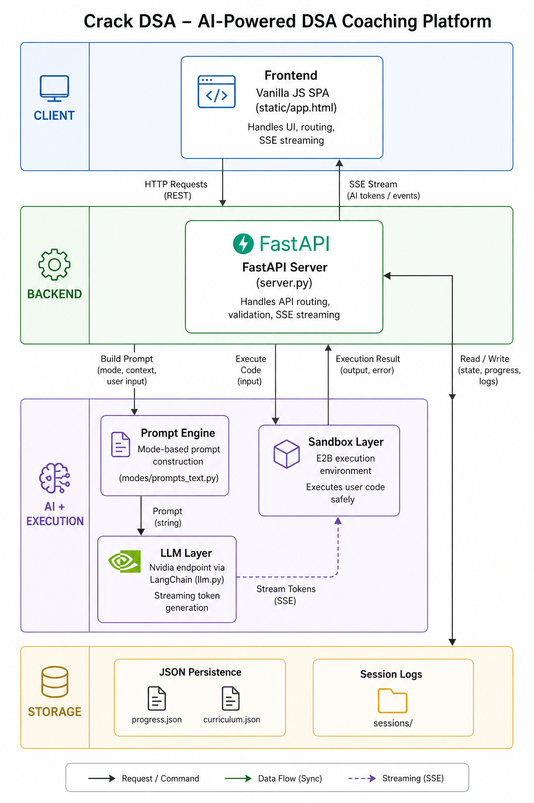

# Crack DSA

> AI-powered DSA coaching platform that enforces real thinking—now with secure sandboxed code execution.


---

## What is Crack DSA?

Crack DSA is a **full-stack AI coaching platform** designed to simulate real FAANG-style interview preparation.

It does NOT behave like typical AI tools that dump solutions.

Instead, it enforces a structured learning loop:
> **Understand → Think → Explain → Validate → Improve**

---

## Why This Exists

Most candidates fail interviews not because they can't code—but because they:
- Jump to solutions without understanding
- Can't articulate trade-offs
- Break under follow-up questioning

Crack DSA directly targets these gaps.

---

## Core Capabilities

### Sandboxed Code Execution (NEW)

Crack DSA now integrates **E2B sandbox execution**.

- Run your own code safely
- Validate correctness and edge cases
- Iterate quickly

**Critical Constraint:**  
The AI still does NOT generate full solutions.

> You write the code. The system helps you think.


### Teaching Mode
- Concept-first explanations (no code)
- Analogies, intuition, ASCII diagrams
- Ends with comprehension checks

### Mock Interview Mode
- Submit your approach (not code)
- Get evaluated like a FAANG interviewer:
  - Verdict
  - Score /100
  - Strengths & gaps
  - Follow-up question

### Progressive Hinting Engine
- Level 1 → Directional nudge  
- Level 2 → Strategy  
- Level 3 → Pseudocode blueprint  

No spoon-feeding.

### Deep-Dive Probing
- Edge cases
- Scaling questions
- Alternative approaches

### Targeted Remediation
- Auto-detect weak topics (<60%)
- Generate focused drills

---

## System Architecture



```

Frontend (SPA - Vanilla JS)
↓
FastAPI Backend
↓
Prompt Engine (Mode-specific constraints)
↓
LLM (Reasoning + Coaching)
↓
E2B Sandbox (Code Execution)
↓
Streaming Response (SSE)

```

### Responsibilities

- `server.py` → API, routing, SSE streaming  
- `llm.py` → LLM interface  
- `state/progress.py` → persistence  
- `static/app.html` → frontend  
- `sandbox/` → E2B execution layer  

---

## Tech Stack

**Backend**
- FastAPI
- Python

**Frontend**
- Vanilla HTML/CSS/JS (SPA)

**AI Layer**
- Nvidia inference endpoints
- LangChain
- Model: `moonshotai/kimi-k2-instruct-0905`

**Execution**
- E2B sandbox

**Storage**
- JSON-based persistence (no DB)

---

## Project Structure

```

Crack_DSA/
│
├── server.py
├── llm.py
├── curriculum.json
├── progress.json
│
├── state/
│   └── progress.py
│
├── static/
│   └── app.html
│
├── modes/
├── sessions/
├── sandbox/            # E2B execution integration

````

---

## Installation

```bash
git clone https://github.com/yourusername/crack-dsa.git
cd crack-dsa
pip install -r requirements.txt
````

---

## Configuration

Create a `.env` file:

```env
NVIDIA_API_KEY=your_key_here
MODEL=moonshotai/kimi-k2-instruct-0905
```

---

## Running the App

```bash
uvicorn server:app --reload
```

Open:

```
http://localhost:8000
```

---

## How It Works

1. User selects topic or submits approach
2. Backend selects coaching mode
3. Prompt engine constrains LLM behavior
4. LLM generates reasoning-focused response
5. Response streams via SSE
6. (Optional) User runs code via E2B sandbox
7. Progress + session logs are saved

---

## Design Philosophy

> **This system is designed to make you think, not skip thinking.**

* No full code solutions are generated
* Reasoning is prioritized over results
* Feedback is structured and iterative

With sandbox execution:

> **Think → Write → Run → Reflect → Improve**

---

## Example Learning Loop

1. Learn concept (Teaching Mode)
2. Attempt problem
3. Get evaluated
4. Ask for hints
5. Write code
6. Run in sandbox
7. Refine

---

## Limitations

* Single-user system (no auth yet)
* JSON storage (no database)
* Depends on external LLM latency

---

## Roadmap

* [ ] Multi-user authentication
* [ ] Spaced repetition engine
* [ ] Web analytics dashboard
* [ ] Voice-based interviews
* [ ] Docker + cloud deployment
* [ ] Multi-language support

---

## Contributing

Contributions welcome in:

* Prompt engineering
* UI/UX improvements
* Performance optimization
* New coaching modes

---

## License

MIT License

---

## Acknowledgements

* Striver’s A2Z DSA Sheet
* FastAPI ecosystem
* LangChain
* Nvidia inference APIs
* E2B sandbox


